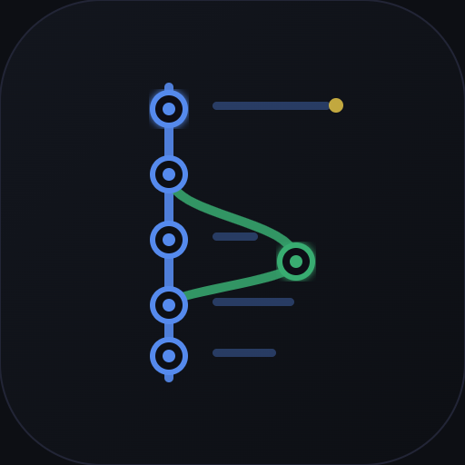
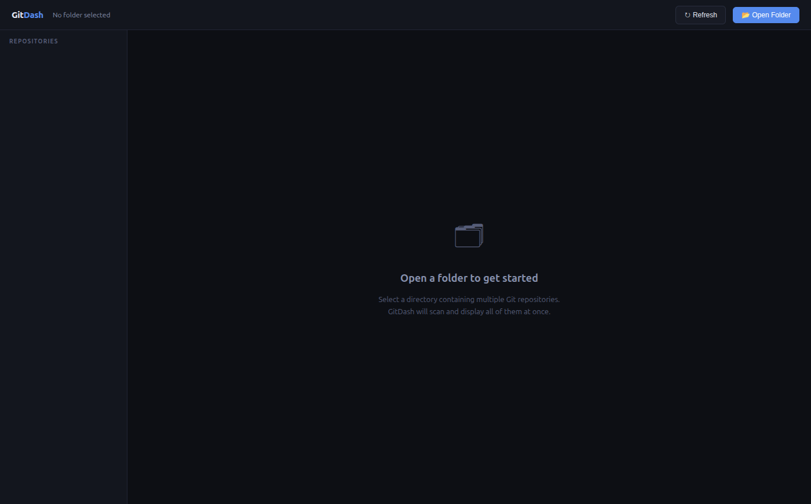
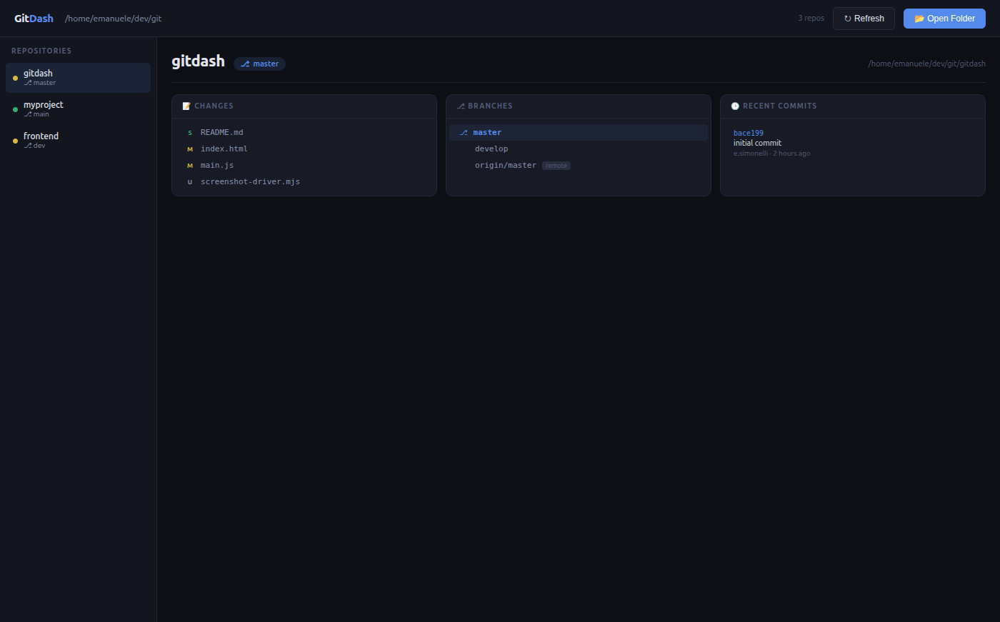
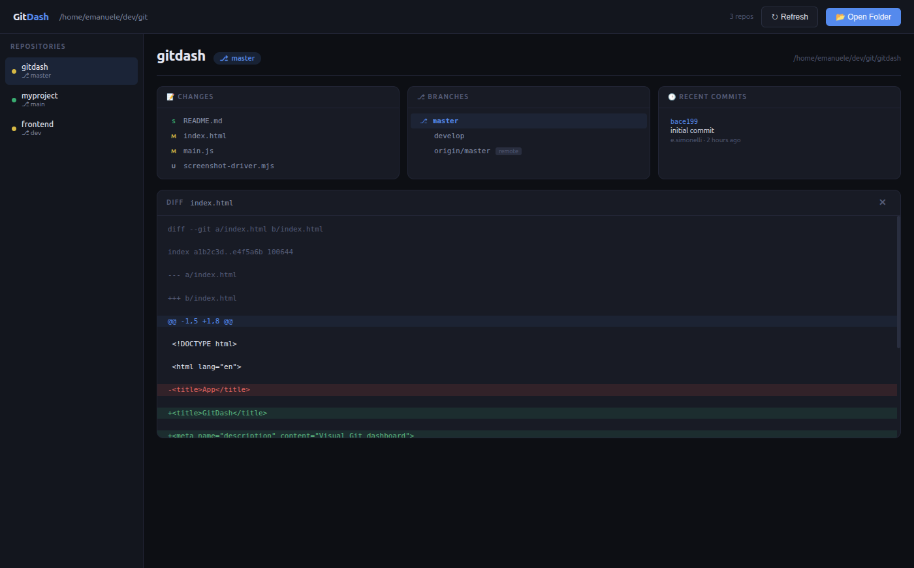

# gitdash



A lightweight Electron desktop app that gives you a unified view of all your Git repositories at once. Open a parent folder and instantly see the status, branches, recent commits, and file diffs for every repo inside — no terminal needed.

## Screenshots

Open a folder to scan all Git repos inside it.



Select any repo from the sidebar to inspect its working tree changes, local and remote branches, and the last 10 commits.



Click any changed file to open an inline diff with syntax highlighting for additions, deletions, and hunks.



## Install

Requires [Node.js](https://nodejs.org).

```bash
npm install
```

## Start

```bash
npm start
```
