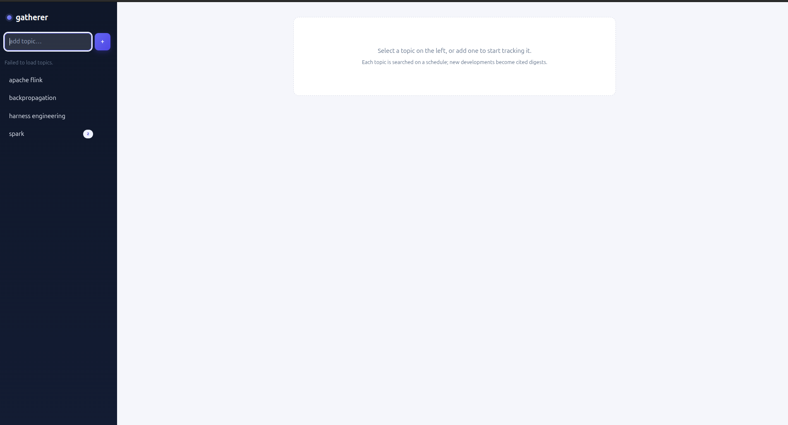
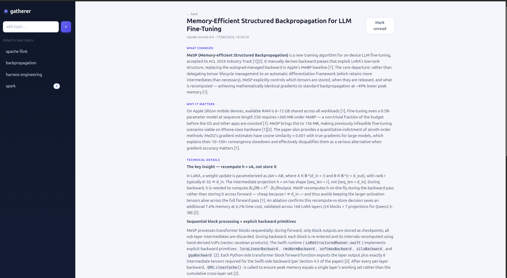

# gatherer — personal tech radar

> Self-updating, cited tech radar — **topics in, agent-written digests out.**

For each **topic** you follow (e.g. "Spark", "Kubernetes", "Go"), gatherer
periodically searches the web for the latest news, releases, and papers, detects
the distinct **developments** within each topic, and produces one cited,
study-ready **digest** per development using Claude — verified against real
sources, never summarized from memory.

```
Topic "Spark" ──┬── Finding "DataFusion Comet"  → digest + sources + images
                ├── Finding "Apache Gluten"      → digest + sources + images
                └── Finding "Spark 4.0 release"  → digest + sources + images
```

What makes it more than "ask an LLM to summarize a page":

- **Topic → many findings, not one blob.** It detects that "Spark" this week
  means *Comet*, *Gluten*, **and** the 4.0 release — and writes each separately.
- **Agentic & grounded.** A ReAct agent searches and fetches pages to *verify*
  before writing, and **cites every claim**. No fabricated facts or sources.
- **Stateful.** It remembers prior findings across runs and only digests what's
  genuinely **new** (or materially updated) — it won't re-summarize old news.

See `ARCHITECTURE.md` for the full design and the rationale behind every decision.

## About & purpose

**The problem.** Staying current in fast-moving areas (data engineering,
distributed systems, languages, infra) means manually trawling release notes,
GitHub releases, arXiv, maintainers' blogs, and engineering posts — scattered
across dozens of sources, on no fixed schedule. It's easy to miss an important
release, a breaking change, or a new project, and quietly fall behind.

**What gatherer does about it.** It turns that chore into a scheduled,
automated research assistant. You declare the **topics** you care about; the
backend periodically does the trawling for you, figures out the *distinct
developments* under each topic, and hands you a cited, study-ready **digest**
for each one — the kind of brief you'd write for yourself after an afternoon of
reading, minus the afternoon.

**Why it's trustworthy.** Every digest is produced by an agent that *verifies
against real fetched sources before writing* and **cites every claim** — it
flags uncertainty and is instructed never to fabricate facts or sources. The
goal is a brief you can actually rely on, not a plausible-sounding summary.

**Who it's for.** An experienced data / software / DevOps engineer who wants to
track specific technologies without babysitting feeds. Digests are written for
that audience — technical, concise, no hand-holding.

**What it is (and isn't).** A personal, single-user tool you run locally with
one `docker compose up`. It is not a multi-tenant SaaS, a general news reader, or
a chatbot — it's a focused, opinionated radar: topics in, agent-written,
deduplicated, source-ranked, cited digests out, with memory of what you've
already seen so it only surfaces what's genuinely new.

**1. Topics (sidebar) + a topic's findings**



```
┌────────────────┬──────────────────────────────────────────────┐
│ ● gatherer     │  Apache Spark                    [ Run now ]  │
│ [ add topic +] │                                               │
│                │  ┌─────────────────────────────────────────┐ │
│ Apache Spark ◀ │  │ DataFusion Comet           [updated]│new │ │
│ Kubernetes  3  │  │ 2026-06-16 14:09                          │ │
│ Go             │  ├─────────────────────────────────────────┤ │
│                │  │ Apache Gluten                       unread│ │
│                │  │ 2026-06-16 14:09                          │ │
│                │  └─────────────────────────────────────────┘ │
└────────────────┴──────────────────────────────────────────────┘
```

**2. Digest view** (the four sections, rendered as Markdown, + sources & images)



```
← back
DataFusion Comet                                   [ Mark unread ]
claude-sonnet-4-6 · 2026-06-16 14:09

WHAT CHANGED
  Comet 0.4 ships native vectorized execution for Spark SQL [1]…

WHY IT MATTERS
  Offloads physical operators to a DataFusion backend, ~2–4× on… [2]

TECHNICAL DETAILS
  • Arrow-native shuffle …  • supported operators …            [1][3]

SOURCES
  1. Comet 0.4 release — github.com/apache/datafusion-comet/…
  2. Benchmarks — …
```

## Stack

- **Frontend:** React + TypeScript (Vite), TanStack Query, React Router,
  react-markdown.
- **Backend:** FastAPI (async), SQLAlchemy 2.0 + asyncpg, Alembic, APScheduler.
- **LLM:** Anthropic Claude via the official `anthropic` SDK (ReAct tool-use loop).
- **DB:** PostgreSQL.
- **Search/retrieval:** Tavily (search + content extraction) + trafilatura.
- **Deploy:** Docker Compose (Postgres + backend + frontend).

## How it works (technically)

A **run** processes one topic end to end. It's triggered by the in-process
scheduler (default daily) or manually via **Run now**, and executes a six-stage
pipeline (`backend/app/pipeline.py`), each stage an independent, testable module:

```
                         ┌──────────── one topic run ────────────┐
 source_discovery ─► fetch ─► rank_dedup ─► finding_detection ─► agent ─► persist
   (Tavily)        (httpx+    (authority +    (Haiku: cluster &   (Sonnet  (Postgres)
                   trafil.)    recency,        drop off-topic)     ReAct
                               dedup)                              loop)
```

1. **source_discovery** — runs several authoritative queries (`"{topic} release
   notes"`, `changelog`, `arxiv`, …) through **Tavily**, which returns ranked
   results *with extracted page text and images in one call* → `CandidateSource`s.
2. **fetch** — for anything Tavily didn't already extract, downloads + extracts
   readable text/images with trafilatura (bounded concurrency; a flaky source is
   skipped, never crashes the run).
3. **rank_dedup** — *pure logic.* Normalizes URLs to drop duplicates, scores each
   source by **authority** (official docs/GitHub/arXiv > blogs > unknown) **+
   recency** (exponential decay), sorted best-first.
4. **finding_detection** — one cheap **Haiku** call groups the flat source list
   into distinct **findings**, names each, and **discards off-topic results**
   (e.g. the "Spark View" remote-desktop product under topic "Spark"). Then a pure
   `decide_novelty` step compares each finding's slug against what's already stored:
   `new` → write, `updated` (enough new sources) → regenerate, else `skip`.
5. **agent** — for each new/updated finding, the **Sonnet** ReAct loop writes the
   digest (below).
6. **persist** — saves the `Finding`, versioned `Digest`, `Source`s, and
   downloaded `Image`s; marks it unread.

### The digest agent (ReAct loop)

`backend/app/modules/agent.py`. For one finding (seeded with its ranked sources),
Claude reasons → acts → observes until it writes the digest. Tools:

- `web_search(query)` — find/confirm sources (Tavily again)
- `fetch_page(url)` — pull a page's text to verify a claim (httpx + trafilatura)
- `write_digest(...)` — emit the final structured output (the exit signal)

```
loop (bounded by AGENT_MAX_ITERATIONS and AGENT_TOKEN_BUDGET):
  ask Claude (adaptive thinking, tools available)
   ├─ web_search / fetch_page  → run tool, append result to the conversation, repeat
   └─ write_digest             → done
final turn OR budget spent:
  force write_digest (thinking off) → guaranteed real digest, then stop
```

The forced final write is why you always get a real, cited digest instead of an
"incomplete" placeholder, and the token budget caps cost per finding. The system
prompt (one editable constant in `prompts.py`) enforces: write for an experienced
engineer, **cite every claim**, never fabricate, flag uncertainty, and output
exactly **What changed / Why it matters / Technical details / Sources** — which
are stored as discrete columns so the frontend renders them as sections.

### Two models, one agent

- **Haiku** (`CLUSTER_MODEL`) — *one* cheap classification call per run to group
  candidates into findings. Not an agent — no loop, no tools beyond its output.
- **Sonnet** (`DIGEST_MODEL`) — the digest **agent**, run once per finding; the
  quality-critical, multi-step work. Swap to Opus via `DIGEST_MODEL` if desired.

### State & cost guards

Findings are versioned (`is_current` flags the latest digest; updates keep
history and re-surface as unread). Re-runs skip already-covered findings, the
agent is double-bounded (iterations **and** token budget), and errors are
isolated per source and per finding so one failure never sinks a run.

## Quick start

1. **Clone and configure env:**

   ```bash
   cp .env.example .env
   # edit .env and set ANTHROPIC_API_KEY and TAVILY_API_KEY
   ```

2. **Bring up the full stack:**

   ```bash
   docker compose up --build
   ```

   This starts Postgres, runs DB migrations on backend startup, launches the
   FastAPI backend (with the in-process scheduler), and serves the React app.

3. **Open the app:** http://localhost:5173
   (Backend API: http://localhost:8000, health at `/api/health`.)

4. **Add a topic** (e.g. `spark`), click into it, and press **Run now** to
   trigger a one-off retrieval. Findings appear as their digests complete; each
   finding has a summary, working source links, and images where available.

## Environment variables

All configuration is env-driven (documented in `.env.example`). The required
secrets are `ANTHROPIC_API_KEY` and `TAVILY_API_KEY`; everything else has a
sensible default. Keys are read from the environment and never logged.

| Var | Purpose | Default |
|---|---|---|
| `ANTHROPIC_API_KEY` | Claude API key (required) | — |
| `TAVILY_API_KEY` | Tavily search key (required) | — |
| `POSTGRES_USER/PASSWORD/DB` | Postgres credentials | `gatherer` |
| `DIGEST_MODEL` | Claude model for digests | `claude-sonnet-4-6` |
| `CLUSTER_MODEL` | Claude model for finding-detection | `claude-haiku-4-5` |
| `DEFAULT_SCHEDULE_CRON` | per-topic run cron (UTC) | `0 6 * * *` (daily 06:00) |
| `SCHEDULER_ENABLED` | enable the in-process scheduler | `true` |
| `LOG_LEVEL` | log level | `INFO` |

Per-topic scheduling: a topic can override the global cron via its
`schedule_cron` (set when creating the topic).

## Scheduling

A daily (configurable) job runs per topic via an in-process APScheduler. The
backend runs **single-worker** because the scheduler lives inside the process —
running multiple workers would fire every job once per worker. To scale the API,
gate scheduler startup behind a leader-election flag (`SCHEDULER_ENABLED`).

## Cost & rate limits

- **Claude:** the ReAct agent is bounded two ways per finding — `AGENT_MAX_ITERATIONS`
  (default 6 turns) and a hard `AGENT_TOKEN_BUDGET` (default 60k tokens of
  input+output+cache). When either limit is reached, the agent is **forced to
  write the digest from what it has gathered** (thinking off, `write_digest`
  forced) rather than looping further — so cost is capped and you still get a
  real digest. The cheap `CLUSTER_MODEL` does finding-detection. Digests default
  to Sonnet 4.6; set `DIGEST_MODEL=claude-opus-4-8` for higher quality at higher
  cost. The SDK auto-retries 429/5xx with backoff.
- **Tavily:** free tier is ~1,000 credits/month; advanced search costs 2 credits.
  `MAX_CANDIDATES_PER_TOPIC` and the query set bound usage per run.

## Development

### Backend

```bash
cd backend
pip install -e ".[dev]"
# run the unit tests (ranking, finding-detection, agent-loop control)
pytest
# run the API locally (needs a Postgres + DATABASE_URL + keys in env)
alembic upgrade head
uvicorn app.main:app --reload
```

### Frontend

```bash
cd frontend
npm install
npm run dev          # http://localhost:5173, proxies /api to localhost:8000
```

### Manual one-off topic run

`POST /api/topics/{id}/run` triggers a run and returns a `run_id`; poll
`GET /api/runs/{run_id}` for status. The "Run now" button in the UI does this.

## Tests

`backend/tests/` unit-tests the logic that's easy to get subtly wrong
(CLAUDE.md §10): `rank_dedup` (URL normalization, authority/recency scoring,
dedup), `finding_detection` (slug, pre-clustering, the new/updated/skip
decision), and the agent loop's control/stopping logic (including the
max-iteration guard and graceful degradation). Run with `pytest` from `backend/`.

## Project layout

```
backend/
  app/
    config.py            env-driven settings
    db/                  engine, models, repositories
    modules/             source_discovery, fetch, rank_dedup,
                         finding_detection, agent, images
    pipeline.py          per-topic run orchestration
    scheduler.py         APScheduler (in-process)
    api/                 FastAPI routes + schemas
    prompts.py           DIGEST_SYSTEM_PROMPT (the one editable constant)
  alembic/               migrations (run on startup)
  tests/                 unit tests
frontend/
  src/components/        Sidebar (topics), TopicDetail (findings), DigestView
docker-compose.yml
```
